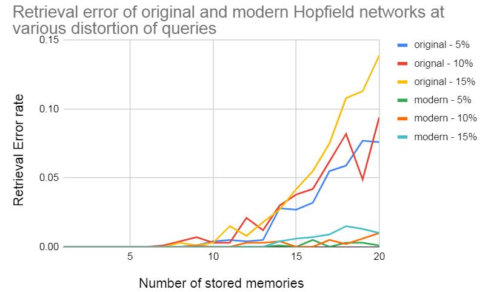

Compare two models: Original and Modern Hopfield networks.

Both programs do the following:
* Store a number of patterns in binary Hopfield net.
* Add noise to a stored pattern and use as query pattern
* Run the model and measure how close it converges to one of the stored patterns.

In general, it gets harder to converge to the stored patterns if there are (1) more patterns stored or (2) the query pattern is more distorted.

## Original Hopfield network
As described in the paper:

[J. Hopfield, Neural networks and physical systems with emergent collective
computational abilities (1982)](https://www.pnas.org/content/pnas/79/8/2554.full.pdf)

Command to reproduce:
```
python original.py --noise-prob 0.05 --n-repeats 50
python original.py --noise-prob 0.10 --n-repeats 50
python original.py --noise-prob 0.15 --n-repeats 50
```

## Modern Hopfield network
As described in the paper:

[D Krotov, Dense Associative Memory for Pattern Recognition (2018)](https://arxiv.org/pdf/1606.01164.pdf)

Command to reproduce:
```
python modern.py --noise-prob 0.05 --n-repeats 50
python modern.py --noise-prob 0.10 --n-repeats 50
python modern.py --noise-prob 0.15 --n-repeats 50
```
## Comparison
Modern Hopfield network has higher storage capacity and achieves lower error rates in retrieval.


```

